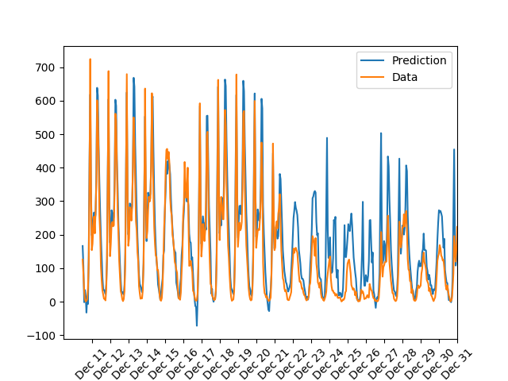
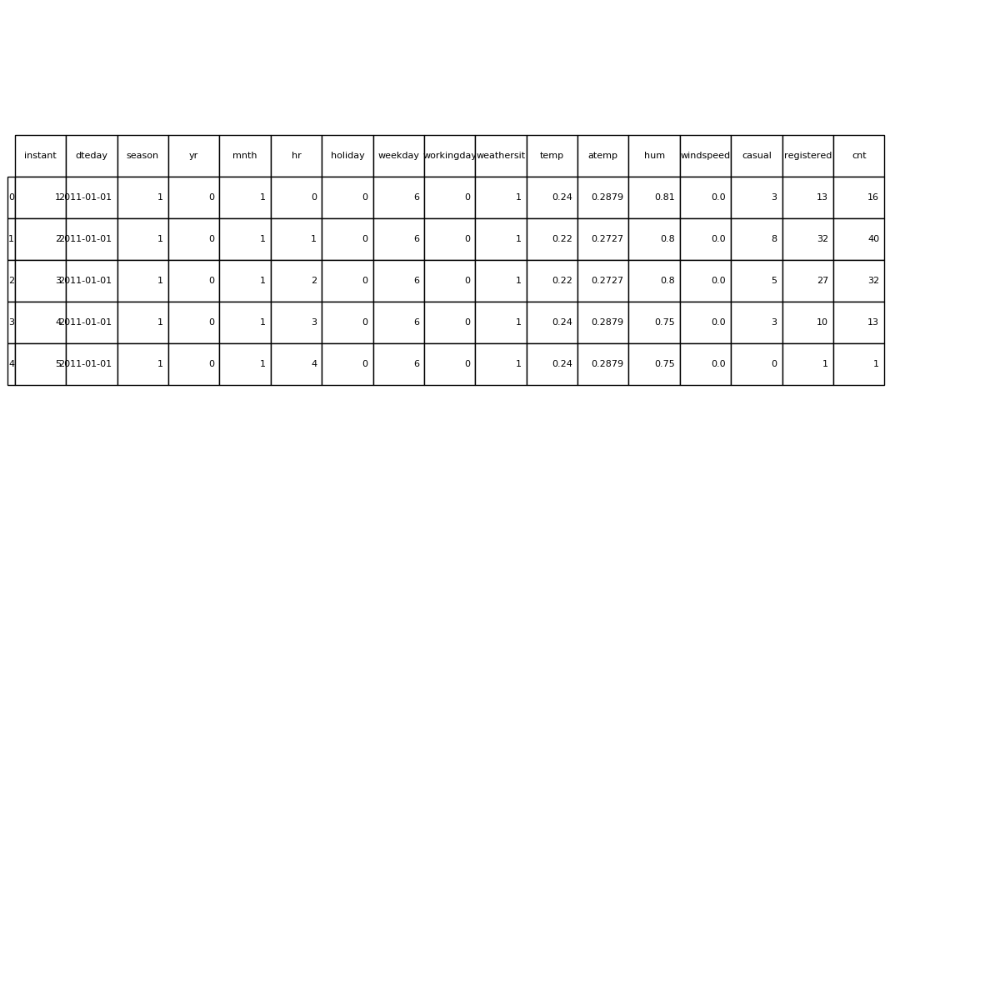
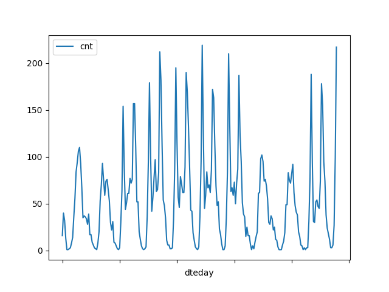
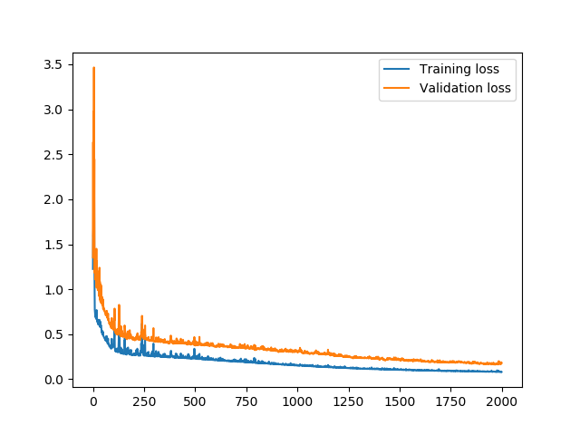

# Neural Network: Predict Daily Bike Rental Ridership

This is the first Udacity project for the Deep Learning Nanodegree.

In this project, I built my first neural network and used it to predict daily bike rental ridership. Some of the code was provided by Udacity. I have implemented some of the neural network. 

The prediction is hows below:

## Data

[UCI](https://archive.ics.uci.edu/ml/datasets/Bike+Sharing+Dataset) - Bike Sharing Dataset Data Set

This dataset contains daily and hourly bike rental information for 2011 and 2012

## Data Cleaning and pre-processing

This step was done by Udacity.

This is the first 5 rows of the dataframe:

Below is the plot of the first 10 days of the dataset:

The continuous variables were standardized and the data was split into training and testing (last 21 days). The last 60 days, excluding the testing set was used to validation.

## Neural Network Architecture

The network has two layers, a hidden layer and an output layer. The hidden layer will use the sigmoid function for activations. The output layer has only one node and is used for the regression, the output of the node is the same as the input of the node. That is, the activation function is $f(x)=x$. A function that takes the input signal and generates an output signal, but takes into account the threshold, is called an activation function. All of the outputs from one layer become inputs to the neurons on the next layer. This process is called *forward propagation*.

The weights are used to propagate signals forward from the input to the output layers in a neural network. We use the weights to also propagate error backwards from the output back into the network to update our weights. This is called *backpropagation*.

This is the plot of the traning and validation loss for 10 hidden nodes:

As explained during the class, if the number of hidden units is too low, then the model won't have enough space to learn and if it is too high there are too many options for the direction that the learning can take. The trick here is to find the right balance in number of hidden units you choose.  You'll generally find that the best number of hidden nodes to use ends up being between the number of input and output nodes.

## Prediction

Blue line shows the predtiction of the bike rental and orange line shows actual bike rentals during the period covered by the dataset.

## Conclusion

The model predicts the data well up to December 21. However, it fails to for the final part of the data. This needs to be investigated further. This is probably caused by the holiday period. 

